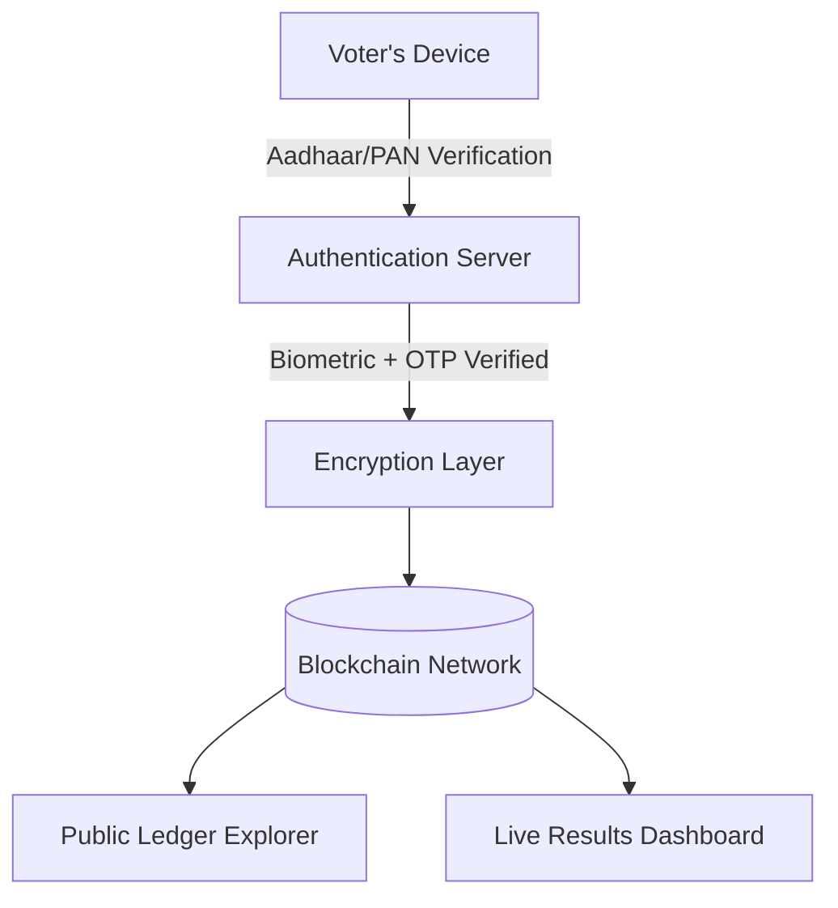

# **Secure & Transparent Online Voting System**

> **A blockchain-powered, Aadhaar-verified, end-to-end encrypted online voting platform.**
> Designed to make elections **tamper-proof, transparent, and verifiable**.

---

## **📌 Overview**

This project aims to build a **fraud-proof digital voting platform** where:

* Every voter’s identity is verified using **Aadhaar (biometric + OTP)** or alternative methods (PAN + face recognition).
* Votes are **encrypted** and stored on a **blockchain ledger** to ensure **immutability** and **transparency**.
* Voters can verify that their votes have been counted without revealing who they voted for.
* Election results can be audited publicly and in real-time.

---

## **🎯 Goals**

* **Prevent voter fraud** (no duplicate votes, no fake identities)
* **Ensure transparency** (public verifiable ledger)
* **Protect voter privacy** (zero-knowledge proofs)
* **Provide accessibility** (online + offline voting options)
* **Enable real-time results** without compromising security

---

## **🛡️ Key Features**

### **1. Voter Authentication**

* Aadhaar API integration (UIDAI)
* Biometric verification (fingerprint/iris)
* OTP verification to Aadhaar-linked phone
* Backup method: PAN + AI-based face match

### **2. Fraud Prevention**

* **1 Aadhaar = 1 Vote**
* Biometric + OTP double authentication
* VPN/Proxy detection & IP logging
* Geolocation-based vote tracking

### **3. Blockchain-Powered Vote Storage**

* Votes recorded on **Ethereum / Hyperledger Fabric**
* **Immutable** & **tamper-proof** ledger
* Public blockchain explorer for verification

### **4. End-to-End Encryption**

* **RSA-4096 + AES-256** encryption
* **Homomorphic encryption** for secure counting
* No plain-text votes at any point

### **5. Zero-Knowledge Proofs (ZKP)**

* Verify vote validity without revealing vote choice
* Maintain anonymity + verifiability

### **6. Voter Receipt**

* Unique transaction hash after vote submission
* Publicly visible in blockchain explorer
* Allows self-verification without revealing choice

### **7. Real-Time Dashboard**

* Public view of total votes per candidate
* Data fetched directly from blockchain
* Exportable audit logs

---

## **🏗️ Architecture**



---

## **⚙️ Tech Stack**

| Component     | Technology Used                       |
| ------------- | ------------------------------------- |
| Frontend      | React.js / Next.js                    |
| Backend       | Node.js / Django REST Framework       |
| Blockchain    | Ethereum / Hyperledger Fabric         |
| Database      | PostgreSQL + IPFS (for proof storage) |
| Biometric SDK | Mantra / Morphosmart / UIDAI APIs     |
| Encryption    | RSA-4096 + AES-256 + ZKP libraries    |
| Hosting       | AWS / Azure / On-Prem                 |

---

## **🔐 Security Flow**

1. **Identity Verification** → Aadhaar API / PAN + Face match
2. **Double Authentication** → Biometric + OTP
3. **Vote Encryption** → RSA-4096 public key encryption
4. **Blockchain Submission** → Transaction recorded & hashed
5. **Vote Verification** → Voter checks hash in public ledger
6. **Counting** → Homomorphic decryption ensures no tampering

---

## **🚀 Installation & Setup**

### **1. Prerequisites**

* Node.js / Python installed
* Blockchain node (Ethereum / Hyperledger)
* UIDAI Aadhaar API access
* SSL certificate for secure communication

### **2. Steps**

```bash
# Clone repository
git clone https://github.com/your-repo/voting-system.git

# Install dependencies
cd voting-system
npm install   # or pip install -r requirements.txt

# Configure environment variables
cp .env.example .env

# Run the application
npm run dev
```

---

## **📜 License**

This project is licensed under the **MIT License**.

---

## **💡 Future Improvements**

* AI-based fraud detection
* Voice-assisted voting for visually impaired
* Integration with government election commission systems

---

## **🤝 Contributing**

We welcome contributions from developers, security researchers, and blockchain experts.

